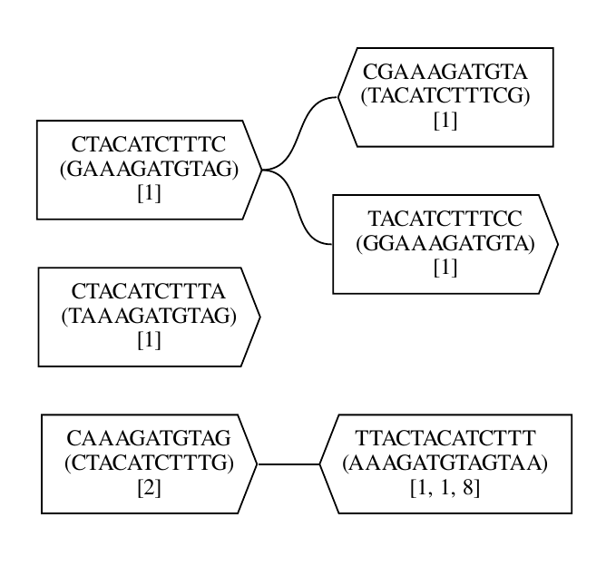

# BCALM Viewer

Generates a graph image with [Graphviz DOT](https://www.graphviz.org/doc/info/lang.html) starting from a [BCALM](https://github.com/GATB/bcalm) generated FASTA file representing a de Bruijn graph of sequencing data.



## Usage
```sh
bcalm-viewer [OPTIONS] [INPUT] [DOT OPTIONS ...]
```
For more information: `bcalm-viewer -h`.

### Workflow example

1. Generate the de Bruijn graph with BCALM:
```sh
bcalm -in list.fa -kmer-size 16 -max-memory 1000 -all-abundance-counts 
```

2. Generate the DOT file and the PDF final file:
```sh
bcalm-viewer -d pdf list.unitigs.fa
```

3. The resulting files are `list.unitigs.gv` and `list.unitigs.gv.pdf`.

## Download builds
  * [Linux (64 bit)](https://gitlab.com/DPDmancul/bcalm-viewer/-/jobs/artifacts/main/raw/target/x86_64-unknown-linux-musl/release/bcalm-viewer?job=linux-musl-64)
  * [Linux (32 bit)](https://gitlab.com/DPDmancul/bcalm-viewer/-/jobs/artifacts/main/raw/target/i686-unknown-linux-musl/release/bcalm-viewer?job=linux-musl-32)
  * [Windows (64 bit)](https://gitlab.com/DPDmancul/bcalm-viewer/-/jobs/artifacts/main/raw/target/x86_64-pc-windows-gnu/release/bcalm-viewer.exe?job=windows-mingw-64)
  * [Windows (32 bit)](https://gitlab.com/DPDmancul/bcalm-viewer/-/jobs/artifacts/main/raw/target/i686-pc-windows-gnu/release/bcalm-viewer.exe?job=windows-mingw-32)

## Requirements
To generate the final file (e.g. `.pdf`) graphviz dot is required. Without it the intermediate file (i.e. `.gv`) can still be generated.

The dot executable must be in system path; in alternative you can set the environment variable `DOT_PATH`.